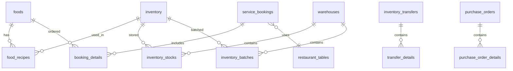
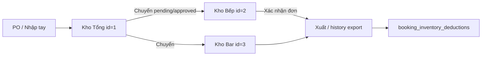
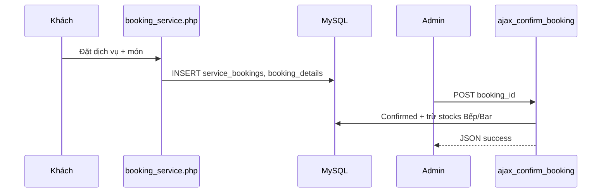

# BÁO CÁO CHI TIẾT DỰ ÁN RESTAURANTLY

**Phiên bản tài liệu:** 1.0  
**Ngày lập:** 23/05/2026  
**Dự án:** Hệ thống quản lý nhà hàng Fine Dining — Restaurantly  
**Database:** `restaurant_db`  
**URL local:** `http://localhost/restaurant-project`

---

## Mục lục

1. [Tổng quan dự án](#1-tổng-quan-dự-án)
2. [Công nghệ & triển khai](#2-công-nghệ--triển-khai)
3. [Kiến trúc mã nguồn](#3-kiến-trúc-mã-nguồn)
4. [Schema SQL — chi tiết từng bảng](#4-schema-sql--chi-tiết-từng-bảng)
5. [Luồng quản lý kho (deep dive)](#5-luồng-quản-lý-kho-deep-dive)
6. [API AJAX — danh mục đầy đủ](#6-api-ajax--danh-mục-đầy-đủ)
7. [Luồng đặt dịch vụ & trừ kho](#7-luồng-đặt-dịch-vụ--trừ-kho)
8. [Phân quyền & bảo mật](#8-phân-quyền--bảo-mật)
9. [Trạng thái Git & thay đổi gần đây](#9-trạng-thái-git--thay-đổi-gần-đây)
10. [Đánh giá, rủi ro & đề xuất](#10-đánh-giá-rủi-ro--đề-xuất)

---

## 1. Tổng quan dự án

### 1.1 Mục tiêu

Restaurantly là website + hệ thống quản trị cho nhà hàng cao cấp, hỗ trợ:

- Trưng bày thương hiệu (banner, video, đầu bếp, combo)
- Đặt chỗ / đặt dịch vụ (bàn, sự kiện, đầu bếp tại gia)
- Quản lý thực đơn, định mức nguyên liệu, kho đa chi nhánh
- Tin tức tương tác (like, comment, share, báo cáo)
- Báo cáo, thông báo Telegram, xuất PDF/CSV

### 1.2 Quy mô

| Hạng mục | Số lượng |
|----------|----------|
| File PHP | ~93 |
| Bảng database | ~50 |
| Endpoint AJAX (admin) | 14 |
| Endpoint AJAX (client/about) | 8 |
| Kho (warehouses) mặc định | 7 |

### 1.3 Cài đặt nhanh

1. Import `restaurant_db.sql` vào MySQL/MariaDB  
2. `composer install`  
3. Copy `.env.example` → `.env`, điền DB / Google / Mail / Telegram  
4. Truy cập: `http://localhost/restaurant-project`  
5. Admin mẫu (README): `28huynhducthong@gmail.com` / `Admin@1234`

---

## 2. Công nghệ & triển khai

### 2.1 Stack

| Lớp | Công nghệ |
|-----|-----------|
| Runtime | PHP 8.x (XAMPP) |
| DB | MariaDB 10.4+, PDO |
| UI | Bootstrap 5.3, Font Awesome 6, JS thuần |
| Config | `vlucas/phpdotenv` |
| Email | PHPMailer 7 |
| OAuth | `google/apiclient` 2.19 |
| PDF | dompdf 3.1 |

### 2.2 Biến môi trường (.env)

| Biến | Mục đích |
|------|----------|
| `APP_URL` | URL gốc ứng dụng |
| `DB_HOST`, `DB_NAME`, `DB_USER`, `DB_PASS` | Kết nối PDO |
| `GOOGLE_CLIENT_ID`, `GOOGLE_CLIENT_SECRET`, `GOOGLE_REDIRECT_URL` | Đăng nhập Google |
| `MAIL_*` | SMTP gửi OTP / mail |
| `TELEGRAM_BOT_TOKEN`, `TELEGRAM_CHAT_ID`, `ENABLE_TELEGRAM` | Thông báo |
| `TELEGRAM_EOD_HOUR` | Giờ gửi báo cáo cuối ngày |

Cấu hình Telegram có thể lấy từ `.env` hoặc bảng `settings` (ưu tiên `.env).

### 2.3 Mở file Word (.docx)

File này là **Markdown (.md)**. Cách mở bằng Word:

- **Word 2019+:** File → Open → chọn `BAO_CAO_DU_AN_RESTAURANTLY.md`  
- Hoặc copy nội dung vào Word, giữ heading/bảng  
- Hoặc cài [Pandoc](https://pandoc.org/) rồi chạy:  
  `pandoc docs/BAO_CAO_DU_AN_RESTAURANTLY.md -o docs/BAO_CAO_DU_AN_RESTAURANTLY.docx`

---

## 3. Kiến trúc mã nguồn

```
restaurant-project/
├── index.php, menu.php, booking_service.php, Aboutus.php ...  # Client
├── views/client/layouts/                                        # header, footer
├── public/          # login, register, assets, admin_layout_header
├── admin/
│   ├── admin_dashboard.php
│   ├── controllers/ # Food, Combo, Inventory, PO, Report, settings...
│   ├── views/       # form/list theo module
│   └── ajax/        # API JSON nội bộ
├── config/          # database, auth, inventory_helper, notification...
├── app/models/      # Booking.php, Chef.php (lớp mỏng)
├── ajax/            # About us: like, comment, share...
└── restaurant_db.sql
```

**Mô hình:** Monolith PHP — mỗi URL map tới một file; logic SQL trộn trong controller/view; chưa có router/framework.

---

## 4. Schema SQL — chi tiết từng bảng

> Nguồn: `restaurant_db.sql` (dump 20/05/2026). Engine: InnoDB, charset `utf8mb4`.

### 4.1 Nhóm Tin tức / About Us

| Bảng | Cột chính | Mô tả |
|------|-----------|-------|
| `about_categories` | id, name, slug | Danh mục tin (Câu chuyện, Đội ngũ) |
| `about_content` | category_id, title, slug, content, thumbnail, is_pinned, status, publish_date | Bài viết tin tức |
| `about_likes` | content_id, user_ip, user_id | Like bài |
| `about_shares` | content_id, platform, user_ip | Lượt xem/chia sẻ (platform: view, facebook, link...) |
| `about_saved_posts` | user_id, post_id | Lưu bài (đăng nhập) |
| `about_comments` | content_id, parent_id, level, author_name, user_id, comment, status, likes, dislikes | Comment lồng nhau |
| `about_comment_likes` | comment_id, user_id | Like comment (đăng nhập) |
| `about_comment_reports` | comment_id, reason, status | Báo cáo vi phạm |
| `about_comment_bans` | user_id, ban_type (ip/account), banned_until | Cấm comment |

### 4.2 Nhóm Marketing & giao diện

| Bảng | Cột chính | Mô tả |
|------|-----------|-------|
| `banners` | image_url, title, description, font_*, text_align, is_active, start_date, end_date, button_* | Carousel trang chủ |
| `videos` | video_type, video_url, file_path | Video giới thiệu |
| `chefs` | name, bio, image, is_featured, sort_order, is_active | Đầu bếp |
| `navigation_menu` | — | Menu điều hướng |
| `footer_settings` | — | Cấu hình footer |
| `footer_links` | title, url, sort_order | Link footer |
| `settings` | key_name, key_value | Cấu hình key-value toàn hệ thống |
| `contacts` | — | Form liên hệ |
| `newsletters` | email | Đăng ký nhận tin |

### 4.3 Nhóm Thực đơn

| Bảng | Cột chính | Mô tả |
|------|-----------|-------|
| `categories` | name, status | Danh mục món |
| `foods` | category_id, name, price, image, status, description | Món ăn |
| `combos` | name, price, image, is_active / status* | Gói combo |
| `combo_items` | combo_id, food_id | Món trong combo |
| `food_recipes` | food_id, ingredient_id, quantity_required, unit | Định mức NVL / món |

\* **Lưu ý:** Một số query dùng `is_active`, một số dùng `status` — cần đồng bộ khi triển khai.

### 4.4 Nhóm Đặt chỗ

| Bảng | Cột chính | Mô tả |
|------|-----------|-------|
| `bookings` | customer_*, booking_date, number_of_guests, table_id, status | Đặt bàn đơn (form trang chủ) |
| `service_bookings` | user_id, customer_*, booking_date, service_type (table/birthday/chef), table_id, combo_id, guests, total_amount, deposit_amount, status, event_type, decor_package, has_cake, has_flower | Đặt dịch vụ cao cấp |
| `booking_details` | booking_id, menu_id, item_type (food/combo/service), quantity, price | Chi tiết món trong đơn |
| `booking_inventory_deductions` | booking_id, ingredient_id, warehouse_id, quantity | Log trừ kho theo đơn |
| `restaurant_tables` | table_code, category (open/room), capacity, price, is_available | Sơ đồ bàn / phòng VIP |
| `services` | service_name, price | Loại dịch vụ catalog |

**Trạng thái `service_bookings.status`:** `Pending` | `Confirmed` | `Completed` | `Cancelled`

### 4.5 Nhóm Kho (trọng tâm)

| Bảng | Cột chính | Mô tả |
|------|-----------|-------|
| `warehouses` | name, type (main/kitchen/bar), status | 7 kho: Tổng(1), Bếp(2), Bar(3), Lạnh(4), Vật tư(5), Xuất(6), Hủy(7) |
| `inventory` | item_name, category, unit_name, cost_price, supplier_id, expiry_date, min_stock, storage_zone | Master nguyên liệu |
| `inventory_stocks` | warehouse_id, ingredient_id, quantity | Tồn theo từng kho |
| `inventory_batches` | ingredient_id, warehouse_id, batch_code, quantity, expiry_date, cost_price | Tồn theo **lô** (FEFO) |
| `inventory_history` | ingredient_id, warehouse_id, type, quantity, performed_by | Nhật ký: import, export, loss, audit_adjust_* |
| `inventory_transfers` | from_warehouse_id, to_warehouse_id, status (pending/completed/cancelled), approved_by | Phiếu chuyển kho |
| `transfer_details` | transfer_id, ingredient_id, quantity | Chi tiết từng dòng chuyển |
| `inventory_audits` | audit_date, performed_by, notes | Phiên kiểm kê |
| `inventory_audit_details` | audit_id, ingredient_id, system_qty, physical_qty, variance | Chênh lệch kiểm kê |
| `inventory_categories` | name, default_warehouse_id | Danh mục NVL → kho mặc định |
| `inventory_units` | name | Đơn vị (kg, lít, chai...) |
| `inventory_receipts` | ingredient_id, supplier_id, quantity, import_price, entry_date, expiry_date | Phiếu nhập (legacy) |
| `suppliers` | — | Nhà cung cấp |
| `purchase_orders` | po_code, supplier_id, status, total_amount | Đơn đặt hàng (PO) |
| `purchase_order_details` | po_id, ingredient_id, expected_qty, expected_price | Chi tiết PO |

**Quan hệ tồn kho:**

```
inventory (master)
    ├── inventory_stocks (tổng theo kho)
    ├── inventory_batches (lô + HSD, FEFO)
    └── inventory_history (audit trail)

inventory_transfers → transfer_details
purchase_orders → purchase_order_details → nhập vào stocks/batches
```

### 4.6 Nhóm Người dùng & nhân sự

| Bảng | Cột chính | Mô tả |
|------|-----------|-------|
| `users` | email, password, role, employee_id, avatar... | Tài khoản khách + staff |
| `user_addresses` | user_id, address, is_default | Sổ địa chỉ (chef tại gia) |
| `employees` | full_name, position, salary, status, avatar | Hồ sơ nhân viên |
| `positions` | — | Chức danh |
| `admins` | username, password | Admin legacy |
| `payrolls` | employee_id, period, amount... | Lương (**UI đã gỡ**) |
| `shifts` | — | Ca làm (**UI đã gỡ**) |
| `shift_assignments` | employee_id, shift_id | Phân ca (**UI đã gỡ**) |

### 4.7 Nhóm khác

| Bảng | Mô tả |
|------|-------|
| `books`, `book_orders`, `book_order_items` | Bán sách nấu ăn (phụ) |
| `notifications` | Thông báo hệ thống |
| `order_items` | Đơn hàng (legacy) |

### 4.8 Sơ đồ quan hệ (ER đơn giản — kho & đặt chỗ)



---

## 5. Luồng quản lý kho (deep dive)

### 5.1 Mô hình đa kho

| ID | Tên | type | Vai trò |
|----|-----|------|---------|
| 1 | Kho Tổng | main | Nhận hàng từ NCC / PO; nguồn chuyển đi |
| 2 | Kho Bếp | kitchen | Xuất NVL khi chế biến / xác nhận đơn ăn |
| 3 | Kho Bar | bar | NVL đồ uống |
| 4 | Kho Lạnh | — | Bảo quản |
| 5 | Kho Vật tư | — | Tiêu hao |
| 6 | Kho Xuất | — | Hàng đã bán (log) |
| 7 | Kho Hủy | — | Hàng hỏng/hết hạn |

### 5.2 Các luồng nghiệp vụ

#### A. Nhập kho nhanh (AJAX)

**File:** `admin/ajax/ajax_update_stock.php`  
**Input POST:** `item_id`, `quantity`  
**Xử lý:**

1. `INSERT ... ON DUPLICATE KEY UPDATE` vào `inventory_stocks` (warehouse_id = **1**)  
2. Ghi `inventory_history` type = `import`  
3. Transaction + JSON response  

#### B. Thêm nguyên liệu mới

**File:** `admin/ajax/ajax_add_inventory.php`  
Tạo record `inventory`, khởi tạo stock kho tổng.

#### C. Chuyển kho có duyệt

**Controller:** `InventoryController.php` + tab transfers  

1. Tạo `inventory_transfers` status = `pending`  
2. Thêm `transfer_details`  
3. Admin duyệt → status `completed`  
4. Trừ `inventory_stocks` kho nguồn, cộng kho đích  
5. Ghi 2 dòng `inventory_history` (export + import)  
6. Badge "chuyển kho chờ duyệt" trên sidebar admin  

#### D. Chuyển kho nhanh (gắn đơn đặt chỗ)

**File:** `admin/ajax/ajax_fast_transfer.php`  
**Input POST:** `booking_id`, `items[]` → `{id, qty, target_warehouse_id}`  

- Gom theo kho đích  
- Tạo phiếu chuyển **completed** ngay (from warehouse = 1)  
- Cập nhật stocks + history + Telegram  
- Dùng khi kho bếp/bar thiếu hàng, cần kéo từ kho tổng

#### E. Đặt hàng nhà cung cấp (PO)

**File:** `admin/controllers/POController.php`  

1. `create_po` → `purchase_orders` + `purchase_order_details` (pending)  
2. Nhận hàng → nhập `inventory_stocks`, `inventory_batches`, history import  
3. API AJAX `action=get_details` xem chi tiết PO  

#### F. Kiểm kê (Audit)

1. Tạo `inventory_audits`  
2. Nhập `physical_qty` từng NVL → `inventory_audit_details`  
3. Tính `variance` = physical - system  
4. Điều chỉnh stocks + history `audit_adjust_up/down`  

#### G. Trừ kho theo định mức món (FEFO)

**Helper:** `config/inventory_helper.php`

- `deductStockFEFO()` — trừ `inventory_batches` theo HSD sớm nhất  
- `createBatch()` — tạo lô khi nhập  
- `convert_to_base_unit()` — quy đổi kg/g, l/ml giữa đơn vị recipe và inventory  

**Lưu ý:** `ajax_confirm_booking.php` hiện trừ trực tiếp `inventory_stocks` (chưa gọi FEFO batches trong luồng xác nhận đơn).

### 5.3 Cảnh báo tự động (admin topbar)

| Cảnh báo | Điều kiện SQL (tóm tắt) |
|----------|-------------------------|
| Tồn thấp | `SUM(stocks) <= min_stock` |
| Sắp hết hạn | `expiry_date` trong 7 ngày tới |
| Chuyển kho chờ | `inventory_transfers.status = 'pending'` |
| Đơn dịch vụ | `service_bookings.status = 'Pending'` |

### 5.4 Sơ đồ luồng nhập → chuyển → xuất



---

## 6. API AJAX — danh mục đầy đủ

### 6.1 Admin (`admin/ajax/`)

| File | Method | Input chính | Output | Chức năng |
|------|--------|-------------|--------|-----------|
| `ajax_add_inventory.php` | POST | item_name, category, unit... | JSON status | Thêm NVL mới |
| `ajax_edit_inventory.php` | POST | id, fields... | JSON | Sửa NVL |
| `ajax_update_stock.php` | POST | item_id, quantity | JSON | Nhập kho tổng |
| `ajax_fast_transfer.php` | POST | booking_id, items[] | JSON | Chuyển kho nhanh từ kho tổng |
| `ajax_confirm_booking.php` | POST | booking_id | JSON | Xác nhận đơn + trừ kho theo recipe |
| `ajax_get_booking_detail.php` | GET/POST | booking_id | JSON booking | Chi tiết đơn cho modal admin |
| `ajax_get_recipes.php` | GET | food_id | JSON array | Lấy định mức món |
| `ajax_save_recipe.php` | POST | food_id, ingredients[] | JSON | Lưu định mức |
| `ajax_sort_chefs.php` | POST | order[] | JSON | Sắp xếp đầu bếp |
| `ajax_footer_links.php` | POST | action=add/delete/update | JSON | CRUD link footer |
| `ajax_about_upload.php` | POST | file | JSON location | Upload ảnh TinyMCE (tin tức) |
| `ajax_about_comment_action.php` | POST | action, comment_id... | JSON | Duyệt/xóa/cấm comment (admin) |
| `ajax_attendance.php` | POST | — | JSON | Chấm công (**UI đã gỡ**) |
| `ajax_approve_attendance.php` | POST | action=approve/reject | JSON | Duyệt công (**UI đã gỡ**) |

**InventoryController** còn expose API nội bộ:

- `POST action=get_reorder_list` → danh sách NVL cần đặt lại (JSON)

**POController:**

- `POST action=get_details` → chi tiết PO (JSON)

### 6.2 Client — About Us (`ajax/`)

| File | Method | Input | Output |
|------|--------|-------|--------|
| `ajax_about_like.php` | POST/GET | content_id | liked/unliked + count |
| `ajax_about_comment.php` | POST | content_id, comment, parent_id | success/error |
| `ajax_about_comment_reaction.php` | POST | comment_id, type=like/dislike | counts |
| `ajax_about_comment_report.php` | POST | comment_id, reason | success |
| `ajax_about_share.php` | POST | content_id, platform | success |
| `ajax_about_action.php` | POST | action=save | lưu bài (user) |
| `ajax_about_likers.php` | GET | content_id | danh sách người like |
| `get_avatar.php` | GET | user_id / emp_id | image binary |

### 6.3 Mẫu response JSON (chuẩn dự án)

```json
{ "status": "success", "message": "..." }
{ "status": "error", "message": "..." }
```

Đặt chỗ chi tiết (`ajax_get_booking_detail.php`) trả object booking đầy đủ (khách, món, bàn, tổng tiền).

### 6.4 Bảo vệ endpoint

- Hầu hết `admin/ajax/*` kiểm tra `$_SESSION['user_id']`  
- `ajax_approve_attendance` yêu cầu role admin  
- Client about: kiểm tra ban IP/account trước khi comment  

---

## 7. Luồng đặt dịch vụ & trừ kho

### 7.1 Client — đặt dịch vụ

1. User đăng nhập → `booking_service.php?type=table|birthday|chef`  
2. Chọn ngày giờ, bàn/combo/món, ghi chú  
3. POST → `config/process_service_booking.php`  
4. Insert `service_bookings` + `booking_details`  
5. Redirect `booking_success.php`  

**Cọc 30%:** tính trên UI; chưa tích hợp cổng thanh toán.

### 7.2 Admin — xác nhận đơn

**File:** `admin/ajax/ajax_confirm_booking.php`

```
1. BEGIN TRANSACTION
2. UPDATE service_bookings SET status = 'Confirmed'
3. SELECT booking_details (menu_id, quantity)
4. Với mỗi food_id:
   - JOIN food_recipes + inventory
   - Quy đổi đơn vị (convert_to_base_unit)
   - Gom theo (ingredient_id, warehouse_id)
     - category 'Đồ uống' → warehouse 3 (Bar)
     - còn lại → warehouse 2 (Bếp)
5. FOR UPDATE inventory_stocks → kiểm tra đủ
6. UPDATE stocks (trừ), INSERT inventory_history (export)
7. COMMIT → Telegram thông báo
```

### 7.3 Sơ đồ end-to-end



---

## 8. Phân quyền & bảo mật

### 8.1 Vai trò

| Role | Backend | Menu cấu hình |
|------|---------|---------------|
| admin / 1 | Có | Có (banner, settings, users...) |
| staff, waiter, chef, cashier / 2 | Có | Không |

### 8.2 Biện pháp đã có

- PDO prepared statements (`ATTR_EMULATE_PREPARES = false`)  
- `.env` bắt buộc (die nếu thiếu)  
- Ẩn chi tiết lỗi DB ra màn hình  
- `config/csrf.php` (một số form)  
- Session gate trên admin  

### 8.3 Điểm cần lưu ý

- URL hardcode `/restaurant-project/`  
- Mật khẩu admin trong README — đổi khi production  
- Một số AJAX attendance còn sót sau khi xóa UI  

---

## 9. Trạng thái Git & thay đổi gần đây

**Nhánh:** `feature-cap-nhat-code-moi`  
**Remote:** `origin/main`

### Commit gần đây (main)

- Merge cập nhật giao diện (#54)  
- Cập nhật code (#53)  
- Feature setup, sửa SQL merge conflicts, chefs/users schema  

### Thay đổi chưa commit (working tree)

**Đã xóa (~1078 dòng):**

- `admin/manage_payroll.php`  
- `admin/manage_shifts.php`  
- `admin/views/attendance/manage_attendance.php`  
- `admin/ajax/ajax_edit_attendance.php`  
- `views/client/employee_dashboard.php`  

**Đang sửa:**

- `ajax_confirm_booking.php`, `ajax_fast_transfer.php`  
- `InventoryController.php`, `manage_services.php`  
- `notification_helper.php`, `admin_layout_header.php`  

---

## 10. Đánh giá, rủi ro & đề xuất

### 10.1 Điểm mạnh

- Kho đa chi nhánh + lô FEFO + PO + audit  
- Đặt dịch vụ 3 loại, UX luxury  
- Tích hợp Telegram, Google, email OTP  
- Tin tức tương tác đầy đủ  

### 10.2 Rủi ro kỹ thuật

| # | Rủi ro | Mức |
|---|--------|-----|
| 1 | `combos.status` vs `is_active` không thống nhất | Trung bình |
| 2 | Xác nhận đơn trừ stocks nhưng không đồng bộ batches FEFO | Trung bình |
| 3 | Module HR xóa UI nhưng DB + AJAX còn | Thấp |
| 4 | Không có payment gateway cho cọc 30% | Trung bình |
| 5 | Monolith khó scale/test | Thấp (dự án học tập) |

### 10.3 Đề xuất roadmap

1. **Ngắn hạn:** Đồng bộ schema combo; dọn AJAX/ menu attendance  
2. **Trung hạn:** Gọi `deductStockFEFO` trong `ajax_confirm_booking`; VNPay/Momo  
3. **Dài hạn:** Front controller, `APP_URL` động, tách service layer  

---

## Phụ lục A — File tài liệu liên quan trong repo

| File | Nội dung |
|------|----------|
| `booking_service_report.md` | Báo cáo phân hệ đặt dịch vụ |
| `artifacts/luxury_bespoke_dining_walkthrough.md` | Hướng dẫn trải nghiệm Bespoke |
| `usecase_restaurant.png` | Sơ đồ use case (hình) |
| `restaurant_db.sql` | Dump database đầy đủ |

---

## Phụ lục B — Settings quan trọng (`settings.key_name`)

| key_name | Mục đích |
|----------|----------|
| restaurant_name, logo_url, name_position | Branding |
| hotline, address, open_time, open_days | Liên hệ |
| inv_auto_deduct, inv_low_stock_threshold, inv_expiry_warning_days | Kho |
| telegram_bot_token, telegram_chat_id, enable_telegram | Telegram |
| telegram_eod_enabled, telegram_eod_hour | Báo cáo cuối ngày |

---

*Tài liệu được tạo tự động từ phân tích mã nguồn và `restaurant_db.sql`. Cập nhật khi có thay đổi schema hoặc luồng nghiệp vụ.*
